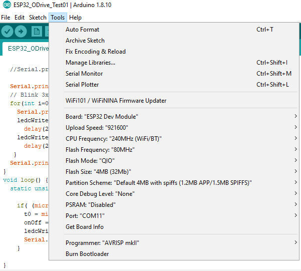

# esp32_odrive

Using ESP32 extra serial communication from HardwareSerial
### Links that helped resolve esp32 odrive communication
#### * https://hackaday.com/2017/08/17/secret-serial-port-for-arduinoesp32/
#### * https://youtu.be/GwShqW39jlE
#### * Much of the code is from the Example file in ODriveArduino Examples: **ODriveArduinoTest**

#### [odriverobotics forum]: https://discourse.odriverobotics.com/t/esp32-odrive-communication-solved/3422/4
# Pin Layout for Sample
<pre>
 PIN | ESP32 | ODrive
 RX  |    16 |  2
 TX  |    17 |  1
 GND |   GND | GND
</pre>

# Configurations

